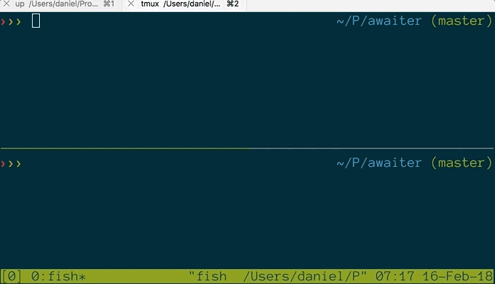

# awaiter

A simple proof of concept for using the latest JS syntax from ES7, even though AWS Lambda is pegged to Node 6.something.

## Instructions:

### Prerequisites

- A recent `nodejs` locally.
- The [`up` command from TJ](https://up.docs.apex.sh/) for deploying simple HTTP apps as Lambdas.

### Build, run, and deploy

- `yarn build`
- `yard start` to test locally
- `up` to deploy
